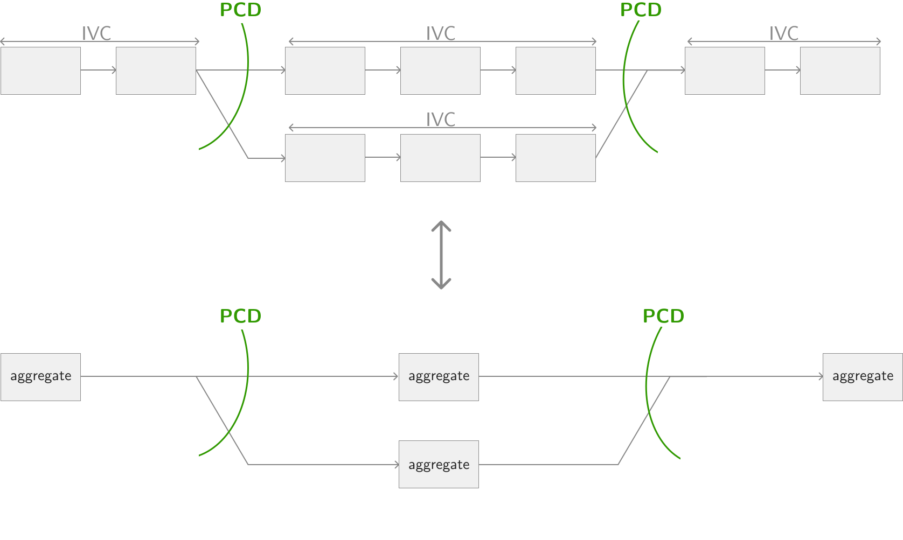

# Architecture

> _This page explains the motivation and reasoning behind creating Starstream as a new virtual machine, and why existing solutions were not sufficient._

Established blockchain Virtual Machines (VMs) like have set robust foundations and created vibrant ecosystems. Given their demonstrated success, introducing another VM like Starstream requires a thoughtful rationale.

Starstream aims to address specific, important trade-offs and limitations in existing VMs by implementing a novel architecture ("coroutines") that not only simplifies development, but also makes Starstream able to fully leverage the power of zero-knowledge (ZK) technologies compared to VMs that previously designed. Notably, Starstream has the following key goals:
1. **Optionality & Upgradability**: Starstream, instead of reinventing the wheel from scratch, instead helps convert any blockchain-agnostic zkVM into a UTXO-based zkVM. This makes it easier to keep the Starstream developer experience while swapping out different proof systems (lattice vs elliptic curve) or even different target architectures (wasm vs risc-v)  
1. **Developer experience**: Starstream is not just a VM, but also comes with a Starstream DSL to not only help developers maximally take advantage of its strengths, but also to provide a great developer experience for UTXO smart contracts.
1. **Client-first**: Starstream proof generation is optimized to run on user devices and in the browser without requiring proof outsourcing to a centralized server. This not only helps ensure decentralization, but also enables a use-cases where proof outsource if often not viable (ex: games)
1. **Confidential computation**: Starstream allows generating proofs of data without revealing the underlying data. This is important for many use-case such as RWA ("Real World Assets") where, for regulatory purposes, underlying data cannot be shared, or for use-cases like gaming where strategy depends on fog-of-war.

Starstream, unlike many solutions, leverages ZK for data protection (private computation) AND scalability (folding schemes)

  
Basics: what is ZK, and how does Starstream use it differently from other solutions?

ZK projects often tackle one of these two problems to varying degrees:

1. **Scalability**: In traditional blockchains, when you call a smart contract, all the nodes in the network will repeat the computation and check they got the same result (slow. This is why you have to pay "gas fees"). However, it doesn't have to be that way. There are many problems where finding an answer is much harder than checking an answer (think: puzzles are often hard to solve, but easy to check if somebody got the answer right). Notably, ZK is often used as a technique to increase the amount of computation the user has to do on their machine in order to decrease the amount of computation the network as a whole has to do (think: solving the puzzle locally, then sharing the answer for everybody to quickly check).
2. **Data protection**: In traditional blockchains, when you call a smart contract, you are sharing all the information about what you want to do (ex: I want to buy token X at price Y). This public information is problematic, as in DeFi it can lead to front-running, for RWAs it can lead to data compliance issues, and for games it makes it impossible to have fog of war. ZK can solve this by sharing the result of the computation without sharing how you did the computation in the first place (think: share the solution to a puzzle without sharing how you solved the puzzle)

Starstream, unlike a lot of ZK solutions, tackles both:
1. **Scalability**: Unlike many ZK solutions which have limited scalability benefits, Starstream allows batching together an infinite amount of computation together in a single proof (sometimes called "recursion" or "folding") allowing significantly more complex applications to be built with it.
2. **Data protection**: Unlike many ZK solutions which don't tackle data protection at all, Starstream supports computation over private data. This means, for example, you can prove you do not live in the US without having to reveal your identity or address, or prove you own an NFT in a collection without having to reveal your address.

Starstream, unlike other solutions, uses the UTXO model (like Bitcoin) instead of the account model for better proof parallelization, faster proofs and lower system requirements.

  
Basics: what is the UTXO model? How does it differ from the account model?

  In the UTXO model (used by Bitcoin and Cardano), tokens behave more like physical coins. Each coin is an indivisible chunk of value that can only be spent once (which is compensated by having change given back to you if you overpaid). Each coin is independent of the rest of the system (in the same way physical coins sit in your pocket) and can only be spent if the right conditions are met (i.e. you, as the coin owner, takes them out of your pocket). Unlike the account model that is global in nature (you don't own ERC20 tokens - they're owned by an shared ERC20 contract, and the contract is the one that specifies who can control how much of the balance), the UTXO model is more naturally sharded as computation is more local which helps in terms of parallelism.

  By contrast, the account model (used by Ethereum) has transactions that mutate this global state directly. This works well in a non-ZK setting, but often leads to concurrency issues where two proofs conflict in a ZK setting (which many protocols solve by having a single "prover" that executes transactions in order).

Starstream, unlike other zkVMs, defines no opcodes. Instead, it allows turning an arbitrary underlying zkVM into a UTXO-based zkVM ready for use in decentralized systems. It does this by modeling every UTXO as an independent program ("coroutine") and proving statements about the relations between these programs.

  
Basics: what is zkVMs, and how does Starstream differ from them?

  Traditionally in ZK circuits have been written manually for each application. Although there are still some performance improvements if this approach is done well, it's harder to write comprehensive systems using these techniques. To tackle this, people have tried building more generic virtual machines ("VM"s) where any computation done on these VMs can, at the same time, generate a ZK proof of the program execution. Some of these target well-known architectures like WASM and risc-v, but others define their own instruction set instead.

  Given the generic nature of these systems, they are often not web3-specific, but rather can prove any program as long as it uses the right instruction set. Starstream takes advantage of this fact by being designed to take a generic zkVM for an opcode set, and turns it into a UTXO-based zkVM where the UTXOs are programs written with the corresponding opcode.

  Note that this concrete leads to two fairly different designs from other systems:
  1. Starstream does not preoccupy itself with how the underlying opcodes are proven. Rather, Starstream adds additional constraints on the system to ensure that the history of the execution of all the programs in the system forms a valid UTXO-based blockchain (see "memory-consistency check" for more)
  2. Starstream does not represent the entire state of the ledger as a single global program (as is usually done with EVM, where all smart contracts are simply apps running inside the master EVM program). Instead, every UTXO is an independent program and we prove statements about the coordination between these programs.

Starstream, although being CPU-agnostic, currently uses WASM as its instruction set ("ISA")

  
Basics: what is the best instruction set to use? WASM? RISC-V? Something else?

\
Starstream uses two key concepts for modelling programs and relations between programs:

(1) Programs themselves are modeled as "coroutines" - that is to say, programs that can pause and be resumed at arbitrary points

  
Intermediate: what are coroutines, and how do we leverage them?

  Typical computer programs run from start to end. However, there are cases where you may want to pause the program during execution. The most common way to do this is with "async": a way to specify that a program may have to "await" until some other computation is done to make progress. Async is a specific type of "coroutine" where the coordination logic is handled by a specific environment (ex: think, the javascript event loop is the one that decides when to resume the program). Coroutines are a more powerful concept where you are not only in charge of writing the program (same as in async), but also writing the coordination as well (similar to programming your own scheduler)

  This gives rise to Starstream's main way to write programs: users provide "UTXOs" which are programs that may yield (coroutine equivalent keyword for "await"), and also provide a "coordination script" which is the scheduler for the transaction.

  Another way to say this is that Starstream works similar to previous UTXO models, but with an extra thing we are tracking: the "frame", which contains information about the program's state such as the local variables (the "stack") and other metadata such as the program counter.

  On a more technical note, specifically Starstream uses asymmetric, stackless coroutines. Stackless coroutines are used to speed up proof generation as you can easily serialize them by simply saving a single frame, and then rehydrating from the serialized frame when continuing execution. This will, as we discuss later, have large implications on the language design.

  Note: sometimes coroutines come in other names: "delimited continuations" are coroutines that can only run once, and "generators" as "delimitated continuations" on function boundaries.

(2) Relation between programs are modeled using "algebraic effects" - that is to say, programs can communicate with each other through emitting effects

  
Intermediate: what are algebraic effects, and how do we leverage them?

  In the context of coroutines / async, we return control flow to the schedule whenever we see a `yield` / `await`. However, there is another construct that can also return control flow to the parent: exceptions. However, the main difference is that exceptions typically cannot be resumed (you can catch an exception, but you cannot return back down the control stack to where the exception was originally thrown - exception continues from after the catch block).

  One can think of algebraic effects as generalization of exceptions: they are exceptions where you can "resume" back from where they were thrown after they're handled. An easy example of where this could be useful is in an `OutOfMemoryException` where, when thrown, it's possible that we can clear some memory (ex: delete some cached data) and then resume.

  We can leverage the resumability property of effects to use them for cross-script communication. For example, if a UTXO wants to ensure that can only run if the user is burning some token in the same transaction, you can use the following flow
  1. throw an effect caught by the coordination script
  2. catch in a coordination script that then then checks that the tx contains a burn of the required token
  3. resume control back to the UTXO if there exists a token burn as required

  You can think of effects as a generalization of `yield`: when you `yield`, there is just one return type (in the sense that functions only have a single return type), and the result goes directly to the parent. With effects on the other hand, you can have multiple effects thrown by a single function, and effects bubble up the stack until they are are caught by some parent.

Starstream uses memory consistency checks to power anything that has a lifetime, including UTXOs (and the current utxo set), the memory of programs, garbage collection and more.

  
Basics: what is a memory-consistency check?

  Memory consistency checks are a technique for ensuring that a piece of memory was deterministically generated from some underlying computation, such that you can now create provable statements about the contents of this memory. For example, the execution of a ZK-proven program can leverage this memory to power its read & write (any LOAD/STORE) operations. Notably, the proof will fail if the memory is modified by an external person or program during (or after) execution.

  Notably, we can use this to represent not just register read & writes, but also other concepts like UTXO creation & spends, and even other concepts like reference count increment & decrements. The key intuition is that anything that has a lifetime can have its lifetime proven by tying it to a MCC - including the lifetime of key constructions like coroutines (UTXOs).

In Starstream, to avoid an infinite winding down of memory when an object's lifetime ends, we
1. Enforce that UTXOs cannot call other UTXOs, and tokens cannot own tokens

  
Basics: transaction balancing

  In a blockchain, all transactions need to be "balanced" - that is to say, funds cannot appear out of nowhere, and cannot disappear to nowhere. To ensure this, blockchain semantics ensure that the inputs of a transaction correspond to the outputs of a transaction (ignoring for a second the minting and burning of tokens).

  This means that, as a developer, you explicitly handle all resources managed by the transaction in a meaningful way. For example, if you consume a UTXO, you must explicitly manage all the tokens that were held inside that UTXO (such as placing those tokens to a new address). However, if we allow infinite nesting of UTXOs, then consuming a UTXO may give you more UTXOs to handle, who may in turn give you yet more UTXOs to handle - potentially creating an infinitely nesting doll which are not only hard for developers to reason about, but are also harder for static analysis to reason about.

2. Model UTXO and tokens as linear types

  
Basics: what are linear types?

  Linear types represent objects which are consumed upon use. This allows us to control lifetimes such that data cannot be freely duplicates and cannot be unexpectedly destroyed. This is exactly what we want to avoid duplication of funds (by ensuring moving a token to a new address consumes the equivalent tokens at the previous address), ensure every token is accounted for (tokens that are spent do not simply disappear, but are handled in a way according to valid semantics such as being explicitly burned or sent to another recipient) as well as proper UTXO semantics (a UTXO cannot be "spent" twice from two different contexts)
  
  Notably, UTXOs are linear types as using them "spends" them, and may create new UTXOs to continue computation in the future. Notably, one can model coroutines with linear types by making that running the continuation "consumes" the object, and creates a new coroutine holding the remaining computation (the state) whenever a `yield` point is hit.

Starstream allows not just proving execution of individual UTXOs, but also allows transactions (coordination scripts) to iterate UTXOs multiple times with the same transaction. Effectively, you can represent a whole tree of computation (of arbitrary depth) where:
- a fan-out represents a UTXOs branching out to create more utxos
- a fan-in represents multiple UTXOs being merged together to create a UTXO result

As coordination scripts model this tree, we they cannot be expressed simply using IVC, but rather have to use a more powerful and flexible primitive called PCD (Proof-Carrying Data) to represent this tree of computation.

  
Basics: what is PCD? How does it differ from IVC? How do we maintain efficiency gains despite requiring PCD?

  Incrementally Verifiable Computation (IVC) is useful when you are proving the linear history of an application. For example, every UTXO and all its resumptions can be modeled as a single (potentially infinite program).

  However, PCD (Proof-Carrying Data) allows computation to fan-in and fan-out which is required to build the execution tree for many use-cases such as interactive protocols. Notably, it supports multiple parties generate different parts of the tree and merging it together in the end, which is often required to model different protocols in open systems such as blockchains.

Starstream maintains significantly faster performance versus other constructions due to its lookup-first architecture which speeds up the protocol not only just at the opcode level, but also allows using IVC to  shorten long execution trees into small trees with fewer PCD iterations.

  
What are lookups, and how do we use them?

  Traditionally, blockchain VMs are implementing by having a target state machine in mind, and then implementing each opcode as a hand-written circuit. However, the overhead of these per-opcode circuits quickly adds up for non-trivial program.

  We can often replace these opcodes by noting that the result of a lot of opcodes can be written as a finite (possibly extremely large) lookup table. For example, adding two 8-bit numbers (256 possibilities) can be represented as looking up a 256x256 table of all possible `<a,b>` pairs. This kind of lookup technique can lead to massive performance benefits over the history of the program, as well as help facilitate a clean abstraction where every opcode is simply another lookup in a different table (making any opcode that can be represented as a table easy to inject into the VM).

  Importantly, this technique is also used to massively speedup execution when UTXOs need to yield and resume multiple times in the same transaction. We do this by representing every resumption of a UTXO (its inputs and its resulting state after execution) as an entry in a virtual table (with a new row for every UTXO execution in the coordination script). With this, from each proof's perspective, the results of calling another UTXO is now simply a virtual table lookup rather than a folding point. Notably, instead of each yield requiring a separate proof chained using PCD, each linear UTXO execution can be chained with IVC, with PCD only needed when branching off or merging in.

  

  Coordination scripts, however, are not simply a root in this execution graph. They also are programs themselves. This means that coordination script executive itself also has to be added to the virtual table

TODO:
- reference functions, reference inputs, concurrency
  - ex: get metadata for a token
  - ex: oracle data. "get data" would be a reference input, but it ALSO throws an effect (without modifying its own memory). In practice, hard because how do you represent this partially computed reference functions. Do you capture it as a lambda? What happens if the underlying UTXO gets consumed while the reference function is still alive.
  - permissions as effects
  - reference inputs are just lookups in the utxo set table (?)
- hardware acceleration
- why lattices (quantum resistant)
- a-la carte / pay per branch
- WIT
- content-addressable
- abi: two columns: [signature, verification key (hash?)]. TODO: should raw code hash (not circuit) also be a column? Need serializable types, etc.

IVC uses:
- fold MCC
- fold opcodes
- fold utxos
- fold txs