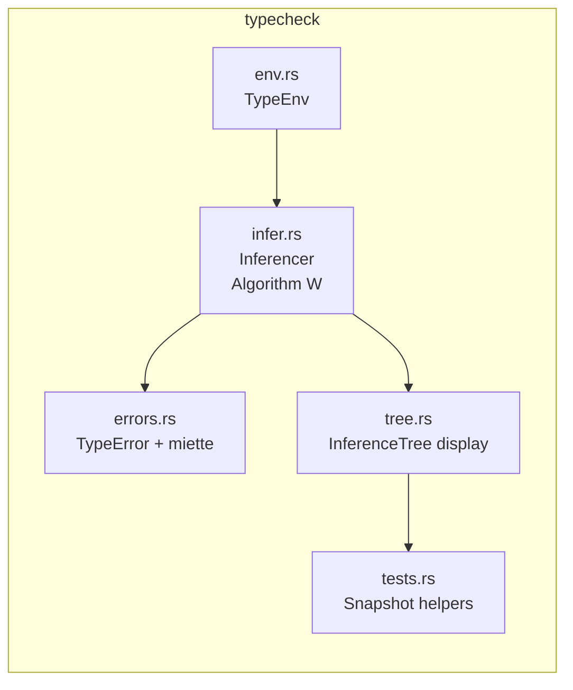

# Starstream Typechecker Notes

This document summarizes the work carried out during the recent hacking session on the type checking pipeline. It is intended for anyone who needs to revisit the decisions, rationale, or internal structure of the `starstream-compiler/src/typecheck` module.

## Overview

We introduced a Hindley–Milner-style inference engine that:

1. Produces a typed AST (`typed_ast.rs`) for downstream consumers (Wasm backend, interpreter, LSP).
2. Emits rich `miette` diagnostics with precise spans and readable labels.
3. Provides detailed inference traces (inspired by `typechecker-zoo`) for snapshots/tests.
4. Integrates into the CLI via a shared diagnostic renderer and a new `check` command.

### High-Level Flow

```mermaid
graph TD
    A[Parse Source<br/>(parser::parse_program)] --> B(typecheck::typecheck_program)
    B -->|TypedProgram| C[Typed AST Consumers<br/>(Wasm, Interpreter, LSP)]
    B -->|InferenceTree| D[Snapshots & Debug Output]
    B -->|TypeError (miette)| E[CLI Diagnostics]
```

## Components



### Detailed Notes

- **Types and Typed AST (`starstream-types`)**
  - Added `types.rs` (primitive types, type variables, schemes).
  - Added `typed_ast.rs` (typed counterparts for statements/expressions).

- **Type Inference (`infer.rs`)**
  - Hindley–Milner Algorithm W with environment snapshots.
  - Traces nearly identical to `typechecker-zoo` ("T-Let", "Unify-Var", etc.).
  - Rich span-aware diagnostics:
    - Parse errors moved to `miette`.
    - Type errors annotate both operands with explicit type messages.
  - `TypecheckSuccess` now collects typed AST + inference trees.

- **Diagnostics**
  - Introduced `starstream-cli/src/diagnostics.rs` with a shared `print_diagnostic`.
  - `starstream-cli` commands (`check`, `fmt`, `wasm`) all use this helper.
  - `check` command now prints `Summary: N error(s)` instead of `Error: type checking failed`.

- **Snapshots**
  - Tests live in `typecheck/tests.rs` with an insta macro that renders inference traces.
  - Snapshot files co-located under `typecheck/snapshots/`.

- **CLI Integration**
  - New `starstream check` subcommand runs parse + typecheck on files/directories.
  - `CheckResult` counts diagnostics to summarize failures.

## Next Steps

1. **Trace Coverage**
   Extend tracing to unification cases inside tuples/functions with context-specific labels.

2. **Performance & Memory**
   Optionally box large `TypeError` payloads to appease clippy without global allows.

3. **LSP Integration**
   Surface type diagnostics and inference hints via the language server.

4. **Linear Types & Resources**
   Use the trace infrastructure to experiment with resource tracking (UTXO/linear usage) on top of HM.

5. **Constraint Categories**
   Migrate from immediate unification to a two-phase pipeline (constraint collection + solving) so we can retain multiple diagnostics per pass and attach “categories” for future features (numeric constraints, traits, linear usage, etc.). Recommended references:
   - Elm compiler’s constraint builder and solver: `elm-compiler/compiler/src/Type/Constrain/Module.hs`
   - “Typing Haskell in Haskell” (Mark Jones), especially the constraint-based presentation of Algorithm W.
   - “Practical type inference for arbitrary-rank types” (Peyton Jones & Shields) for ideas on obligation tracking.
     Suggested approach:
   - Augment the existing expression walker so it emits constraint records (value, environment snapshot, category hint, span, and diagnostic builder).
   - Introduce a constraint store keyed by expression IDs; the solver runs separately, updating a substitution map but never mutating the AST, allowing us to continue after failures.
   - Classification hooks: start with `Standard`, `Numeric`, `Boolean`, `Linear`, `Trait` buckets to let future solvers handle each domain independently.
   - Gate the new pipeline behind `TypecheckOptions`, keeping today’s fail-fast mode available until the constraint solver is battle-tested.

6. **Canonicalization**
   Reintroduce a canonicalization pass (Elm’s `Canonicalize.Module`) before type inference once we have modules/imports. The canonicalizer resolves identifiers, qualifiers, and pattern-bound names into unique, globally-traceable IDs, making later passes deterministic and friendlier to IDE tooling.
   - Elm reference: `elm-compiler/compiler/src/Canonicalize/Module.hs`
   - Useful reading: “Compiling with continuations, continued” (Flanagan et al.) for environment normalization patterns.
   - Suggested roadmap: build a `canonicalize` crate that walks `ast::Program`, normalizes bindings, annotates nodes with fully-qualified names (module + symbol), and records alias information. Type inference would then operate over canonical names, while the original AST stays available for formatting/pretty printing.

7. **User-Facing Commands**
   Consider adding a `--trace` flag to CLI (`starstream check`) to print the inference tree interactively.

8. **Documentation & Guides**
   Expand this README with detailed examples or walkthroughs for contributors.
