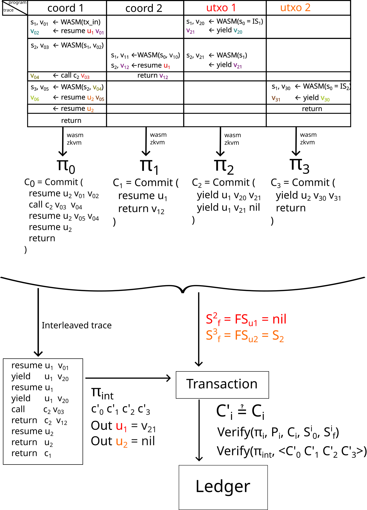
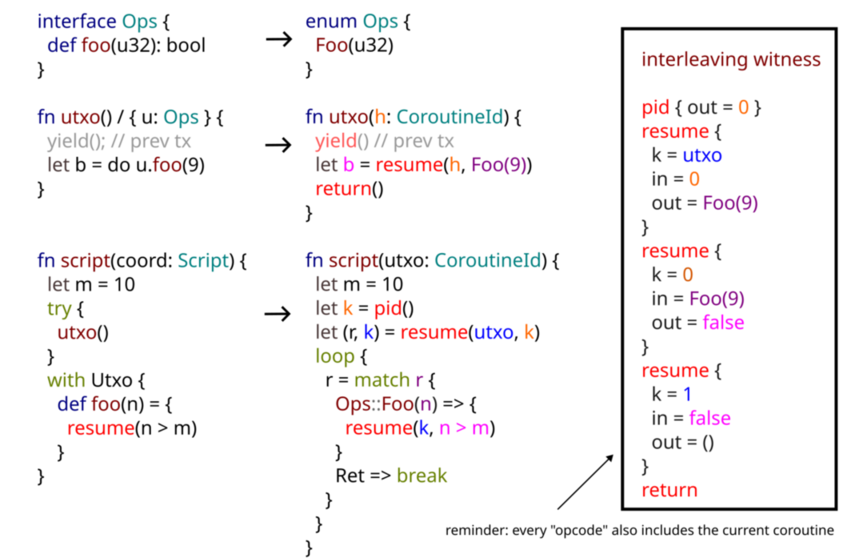

## About

This package implements a standalone circuit for the Starstream interleaving proof.

### Architecture

Let's start by defining some context. A Starstream transaction describes
coordinated state transitions between multiple concurrent on-chain programs,
where each transition is analogous to consuming a utxo (a utxo is a one-shot
continuation). Each program is modelled as a coroutine, which is a resumable
function. Resuming a utxo is equal to spending it. Yielding from the utxo is
equivalent to creating a new utxo.

The ledger state for a program (utxo) is described by:

1. A coroutine state. Which includes a program counter (to know from where to
resume the execution), and the values of variables in the stack.
2. The value of the last yield.

The programs are represented as WASM modules, although the actual ISA does
not matter here. A program can either do native WASM operations, which for the
purposes of the interleaving verification is just a blackbox, or it can interact
with other programs.

A program is either:

1. A coordination script. Which has no state persisted in the ledger. Since it's
stateless, the proof needs to also ensure that it runs fully. They can suspend
for calling into effect handlers, but this is just internal to the transaction.
2. A utxo, which has persistent state.

Coordination scripts can call into utxos with their address, or other
coordination scripts (these get transient ids that are local to the
transaction).

Coordination scripts calling into each other is equivalent to plain coroutine
calls.

Yielding doesn't necessarily change control flow to the coordination script
that called resume, because the transaction may end before that, and the next
coordination script could be a different one. Also because we have algebraic
effect handlers, control flow may go to a coordination script that was deeper in
the call stack.

As mentioned before, programs are modelled as WASM programs, both in the case
of coordination scripts and in the case of utxos. Inter-program communication is
expressed as WASM host (imported) function calls. To verify execution, we use a
*WASM zkVM*. When proving, the only thing we assume about host calls is that the
only memory modified by it is that expressed by the function signature.

This means we can think of a program trace as a list of native operations with
interspersed black-box operations (which is effectively a lookup argument of
host call execution).

From the program trace, we can use the zkVM to make a zero knowledge that claims
that.

1. The ISA instructions were executed in accordance with the WASM ISA rules.
2. Host calls interact with the stack according to function types.

A single proof does not claim that the values returned by host calls were
correct.

In the case of lookup arguments for the optimizations (e.g. witnesses for
division, sorting), this can be extended by adding some verification of the
returned values. This spec doesn't focus on this specific case.

The case that matters for this spec is the case where the host call is supposed
to trigger a change in ledger state and get some value from another program.

### Transaction

A transaction is made of:

1. A list of inputs. And input is a "pointer" to an entry in the ledger state (a
utxo). The entry in the ledger state has the serialized coroutine state and a
verification key for a zk proof that gatekeeps spending.
2. A list of outputs (these are the new entries to the ledger). These also need
to have a reference to input they are spending, if any.
3. Proofs:

- One proof per input.
- One proof per coordination script (and there is at least one).
- The verification keys (which include a hash of the wasm module) for all
coordination scripts.
- The entrypoint (an index into the coordination scripts verification keys).
- The transaction or interleaving proof.

Verification involves:

1. For each input (spent utxo), take the proof (in the tx) and the verification
key (in the ledger).
2. Find if there is an output referencing it (if not, just use null).
3. Run `proof.verify(input, verification_key, output)`.
4. If succesful, remove that input from the ledger. And insert the new output.
Remove the output from the list.
5. Outputs without an input can just be added to the ledger.
6. Verify each coordination script proof by itself. Potentially in parallel.
7. Verify the interleaving/transaction proof. Verification for this uses a
commitment to all the lookup tables used in the other proofs.

**Note** that the above could be compressed into a single proof too by encoding
the above as a circuit (with PCD for the wasm proofs, probably?), this is the
unaggregated scheme.

The basic "ledger" operations that we care about are:

### Shared

- resume(f: Continuation, value: Value) -> (Value, Continuation)

Changes control flow from the current program to the utxo. The `value` argument
needs to match the return value of the last `yield` in that program.

It's important that you get a handle too when resumed, since that allows
basically RPC, by allowing the utxo or coordination script to answer back with
an answer for a request. This means an effect handlers involves two resumes in a
row in a caller -> handler -> caller flow.

When performed from a utxo, these don't create a utxo entry. It's expected that
effect handlers are atomic in the transaction.

The circuit for resume needs to take care of:

1. The Continuation returned matches the previous program (the previous opcode
in the witness was a resume from that program).
2. The next opcode in the witness trace has a vm id matching `f`.
3. The next opcode for the resumed utxo (which could be yield or resume) has a
return value that matches the input.
4. Utxo's can't resume utxos.
5. Maybe check that continuations are linear/one-shot (by enforcing a nonce on
the continuation). Not sure if this is needed or utxos can just take care of it.

- program_id(f: Continuation) -> ProgramId

Get the hash of the program with the given id. This can be used to attest the
caller after resumption. For example, a method that only wants to be called by a
particular coordination script.

** NOTE: ** that using this for attestation is fundamentally the same as lookup
argument. That is, instead of asking the program id and asserting a fixed one,
you could just ask for a proof and verify it with the program's key.

The difference is that this allows "batching" (each check is just a lookup into
a process table, and there can be a single proof). It also has the flexibility
of allowing indirection to have a list of allowed callers, for example.

#### Coordination script

- new(utxo: UtxoProgramHash, ..args) -> Continuation

Creates a new entry in the utxo set in the ledger state. It registers the
`ProgramId`, which acts as a verification key, and sets the initial coroutine
state. `Continuation` is basically the address.

- new_coord(coord: CoordScriptHash, ..args) -> Continuation

Register a new coordination script in this transaction, in a cold state (don't
start running it). It can then be called with `resume`. The `args` are the input
to the coordination script.

When doing the non-zk mode run, this doesn't need to do anything except allocate
a new id for this vm and recording the inputs. But it also would be possible to
allocate it and write the inputs to the initial stack.

In the interleaving circuit this is similar. This generates a new transient id
for this wasm vm, which is used as the continuation id. Then it stores the input
in memory. When checking the aggregated proofs, the verifier needs to use the
same inputs to verify the coordination script wasm proof.

#### Utxo

- yield() -> (Value, Continuation)

Pause execution of the current utxo and move control flow to the previous
coordination script if any. If not, this creates a new utxo entry, with the PC =
current pc and the coroutine state with the current variables.

The difference with `resume` is that it doesn't take a continuation as a target.

Because of this, only `yield` can be used as the last operation for a utxo in a
transaction.

- burn()

Explicit drop in the utxo's program. This removes the program (and the coroutine
state) from the ledger state. It's equivalent to a coroutine return.

##### Tokens

- bind(token: Continuation)
- unbind(token: Continuation)

Relational arguments. The ledger state has to keep relations of inclusion, where
tokens can be included in utxos.

### Proving

All the operations that use the ledger state are communication operations. And
can be thought of as memory operations. Taking inspiration from offline memory
checking (and Nebula), we can bind each proof to an incremental commitment to
all the ledger operations in the current transaction.

Let's say we have a coordination script, and after execution we get a trace like:

```
wasm_op_x
r1 <- call resume utxo_id v1
wasm_op_y
r2 <- call resume utxo_id v2
wasm_op_z
```

We use the zkVM and we get a proof of that execution. And also the proof is
bound to an incremental commitment `C_coord_comm := Commit(resume, v2, r2) +
Commit(resume, v1, r1)`.

The straightforward construction for this is by using iterative hashing, for
example with Poseidon. For example: `H(<resume, v2, r2>, H(<resume, v1, r1>,
<nop, 0, 0>)`.

To reduce the amount of hashing required, a more efficient construction would be
to combine a hash function with a vector commitment scheme, reducing the hashing
needed to one per operation.

Note that we also need to include a tag for the operation in the commitment,
since that fixes the order of operations.

Now let's say we have the trace of the utxo that gets resumed. It forms a
dual or complement with the coordination script trace. Where a yield is dual
to resume:

```
wasm_op_a
z1 <- call yield y1
wasm_op_b
z2 <- call yield y2
wasm_op_c
```

Then we bind the zkVM wasm proof to a different commitment:

`C_utxo_comm := Commit(yield, y2, z2) + Commit(resume, y1, y1)`

Then we can generate a new trace with the _actual_ interleaving defined by
the functional dependency, by combining both executions into the right order
of interleaving:

```
resume utxo:utxo_id in:v1 out:r1
yield  utxo:utxo_id in:y1 out:z1
resume utxo:utxo_id in:v2 out:r2
yield  utxo:utxo_id in:y2 out:z2
```

Then we need to prove the following things:

1. The exchange of messages match.

In this case this means that all of these hold:

  - `v1 == z1`
  - `r1 == y1`
  - `v2 == z2`
  - `r2 == y2`

2. The exchanged values match the ones in the individual original traces.

For this we get a single proof, and two commitments: 

- `C_coord_coom'`
- `C_utxo_coom'`

Then the verifier can check that the commitments match the ones from the
original proofs. This also enforces the same order of operations (and values) in
both (or all n in general) proofs.

3. The order matches the ids. That is, a resume to a certain utxo_id must match
the id of the utxo that yields in the next step.

*Note*: The interleaving proof doesn't need to know about the coroutine states,
just about the values of yield and resume.

### Example

As a more general example, let's say we have two coordination scripts and two utxos.

```
fn coord1(input: Data, u1: Utxo1, u2: Utxo2) {
  let v_01 = f(input);
  let v_02 = resume u1 v_01;

  let v_03 = g(v_03);

  let v_04 = coord2(v_03);

  let v_05 = h(v_04);
 
  let v_06 = resume u_2 v_05;
  resume u2 nil;

  return;
}

fn coord2(u1: Utxo1, v_10: u32) {
  let v_11 = f(v_10);
  let v_12 = resume u1;
  return v_12;
}

utxo Utxo1 {
  main {
    // current state
    yield;

    yield v_20;
    yield v_21;
  }
}

utxo Utxo2 {
  main {
    // current state
    yield;

    let v_31 = yield v_30;
    return;
  }
}
```

The flow of execution to proving then looks something like this:

Note: WASM is an arbitrary trace of wasm opcodes from the corresponding program.



## Proving algebraic effects

### Background

Algebraic effect handlers involve two things:

**The ability to declare which effects can be performed by a function.**

For example:

```rust
fn pure(x: u32) : u32 / {} = {
  x + 1
}
```

```rust
fn effectful(x: u32) : u32 / { IO } = {
  do print("x: " ++ x)

  pure(x)
}
```

In their simpler form, the effects of a function are the union of all the
interfaces used in its body. In this case we can imagine that IO is an interface
that allows printing:

```ts
interface IO {
  print(x: String): ()
}
```

**The ability to define handlers for effects.**

```rust
fn pure2(x: u32) : (u32, String) / {} {
  let mut logs = "";

  try {
    effectful(x)
  }
  with IO {
    def print(s) = {
      logs += s;
      logs += "/n";

      resume(());
    }
  }
}
```

In a way, interfaces define a DSL of allowed operations, and handlers give
meaning to those operations by running them.

Depending on the implementation, we can distinguish between a few types of
handlers:

1. Single tail-resumption.

```python
with Interface {
  def op(x: u32): u32 {
    let y = x+1
    resume(y)

    # nothing happens here
  }
}
```

There are basically equivalent to function calls. In an environment with shared
memory, these can be implemented as closures.

In our case, since the continuation could (will?) be running in a different VM
instance, instead we need to think of this more like a channel, where we use a
host call to pass the data from one VM to the other.

The important thing is that control flow doesn't need to go back to the handler.


2. Single non-tail-resumption.

```python
with Interface {
  def op(x: u32): u32 {
    let now = Time.now();

    let y = x+1
    resume(y)

    print(now.elapsed()); # we eventually come back here after the continuation finishes.
  }
}
```

The tricky part about these is that the handler may be invoked again before
reaching the "exit code".

There are at least two ways of handling that.

One is to put the code after resume in a stack, potentially as a closure. Then
before resuming, the continuation code gets pushed into a stack (in the function
stack).

The other way is to make the handler run in its own VM, and just spawn a new one
(with its own proof) per call to the handler.

3. Storing the continuation

```python
let queue = emptyQueue();
try {
  f()

  while let Some(k) = queue.pop() {
    k()
  }
}
with Interface {
  def op(x: u32): u32 {
    queue.push(lambda: resume(x + 1))
  }
}
```

This can be compiled into a local closure (can only be called from the same
program), so it's not different from just executing the resumption inline.

The issues with this are more about:

- linearity: probably want to resume every program at least once (so the queue
has to be linear), and not allow resuming twice (since probably we don't want
this feature)
- static checking of captures maybe, since the call to `k` in the `try` may also
perform effects. It also shouldn't be possible to return the boxed closure.

4. Non resumptive

```python
with Interface {
  def op(x: u32): never {
    print(x + 1)
  }
}
```

This is not necessarily difficult to implement, and it needs to happen at the
last yield of a utxo in the transaction anyway, since the resume will happen in
the next transaction.

We may not want to allow defining these though, and enshrine `yield` as a
special effect.

5. Multi-shot

It's still undecided whether we want to have this feature (and what would be the semantics

## Proving

The cases outlined above can be proved with the architecture outlined in the
previous section without too many changes. The main constraint that we have
is that we can't share memory trivially, which also means we can't just send
closures back and forth. What we can pass back and forth however is the id
of a VM instance (a coroutine). Note that these can be just transaction-local
identifiers, like an index into a contiguous memory/table. Program identifier
hashes can be stored in this table and verified when necessary, but the main
thing we care about here is about interleaving consistency.

The general outline follows.

Each effectul function receives a dictionary mapping effects to coroutines.
This can be just encoded through parameter passing. So a function with type: `()
-> () / { singleton_effect }` is compiled into a function of (wasm) type `(k:
coroutine_id) -> ()`. This is sometimes called implicit capability passing.

This is most likely simpler to prove, but the alternative is to have the the
interleaving proof machinery keep track of the dictionary of installed handlers
(and uninstalling them). The trade-off is a slightly more complicated ABI.

Invoking a handler is _resuming_ a specific coroutine (received as an argument).
The operation to perform can be passed as an argument encoded as a tagged union.
The tag doesn't have to be a small integer like it's usually done with enums, it
can be for example a hash that identifies the operation.

Installing a handler is conceptually:

1. Passing the current continuation id (wasm vm) as a parameter in the right
position.  (Or call an operation to register a handlers for a certain operation,
in the alternative way).

2. Setup a trampoline-like loop to drive the handlers. Note that if the
operation is not supported we can just flag an error here that aborts the
transaction.

### Tail-resumptive basic code lowering example:



*Note:* matching colors are for the equality constraints that need to be
enforced by the proof, or to identify the coroutine id.

### Non tail-resumptive example:

For non-tail resumptive effects, the main difference is that a stack (heap
memory) is needed to keep track of the "exit calls" to run after resumptions.

For example, the script could look like this:

**Note** that this also technically stores a continuation.


## Concurrency + channels

First thing to note here is that effect handlers are well studied for
implementing user-defined concurrency primitives.

Some references (for something like green threads):

https://kcsrk.info/ocaml/multicore/2015/05/20/effects-multicore/

Note that a fiber is not really that much different from a sandboxed wasm
function, except maybe for the overhead. Capturing a fiber by a pointer is not
any different than just having an id for each vm and storing that.

There is also effekt:

https://effekt-lang.org/docs/casestudies/scheduler

Implementing channels on top of that is not necessarily that far-fetched.

See for example:

https://tinyurl.com/4rsf6738

But a more sophisticated system can also be implemented by also implementing
things like signals.

The argument here is that algebraic effect handlers can be used to implement a
user-defined scheduler for multi-threading (and there are libraries that do this
in ocaml, scala, effekt, and probably others), so why hardcode one into the
ledger instead of just providing the primitives for that (one-shot
continuations).

Especially considering that with zk we can just hide it from the ledger just by
encoding the control flow and communication rules into the interleaving circuit
(which the ledger knows about, but it's an opaque verification key required to
accept a transaction). That also makes it easier to port Starstream to different
ledgers.

An example (may be buggy, treat as pseudocode) of how this would work in our
case:

** DISCLAIMER: ** I'm going to use a mix of low level and high level syntax to
try to make things less magic. I'm going to use the high-level syntax for effect
handler definitions (see previous section for the lowering to the ISA).  But a
lower-level syntax for coordination script handling, wherever needed.

```typescript
type EventId = u64;
type ChannelId = EventId;

// a green threads scheduler with conditions/signals
interface Scheduler {
  fn suspend();
  fn wait_on(EventId);
  fn signal(EventId);
  fn schedule(Continuation);
}

interface Channel {
  fn new_chan(): ChannelId;
  fn send(ChannelId, Any);
  fn recv(ChannelId): Any;
}
```

```rust
mod concurrent {
  script {
    // actual high-level definition
    fn with_threads(f: () => () / { Scheduler });

    // lower level definition
    fn with_threads(f: Continuation) {
      let queue = empty_queue();
      let conditions = empty_map();

      queue.insert(|| f.resume());
      // which lowers to:
      // queue.insert(|| starstream::resume(f));

      while let Some(next) = queue.pop() {
        try {
          next();
        }
        with Scheduler {
          fn suspend() {
            // reminder, this is a closure that just captures a "pointer" to a
            // wasm sandbox (continuation or fiber if you want).

            // and this is just a local closure, it can't be sent to other vm
            // (since that requires shared memory).
            //
            // check the previous section for the low level representation.

            // NOTE that it's not **possible** to make a transaction without
            // resuming each task that calls `suspend` as long as this scheduler
            // is used.

            // That's because the coordination script doesn't end in that case,
            // so it's not possible to make a proof.
            queue.push(|| resume());
          }
          fn wait_on(event) {
            conditions.insert(event, || resume());
          }
          fn signal(event) {
            if let Some(k) = conditions.remove(event) {
              queue.insert(k);
            }

            resume();
          }
          fn schedule(k) {
            queue.insert(k);

            resume();
          }
        }
      }
    }

    // actual high-level definition
    fn with_channels(f: () => () / { Channel });

    // low-level representation
    fn with_channels(f: Continuation) {
      let channels: Map<ChannelId, Queue<Any>> = empty_map();
      let channel_id = 0;

      try {
        resume(f, ());
      }
      with Channel {
        fn new_chan(): ChannelId {
          channels.insert(channel_id, empty_queue());

          channel_id += 1;
        }
        fn send(channel_id, msg) {
          channels[channel_id].push(msg);
          do signal(channel_id);
          do suspend();
        }
        fn recv(channel_id): Any {
          if let Some(msg) = channels[channel_id].pop() {
            resume(msg);
          }
          else {
            do wait_on(channel_id);

            let msg = channels[channel_id].pop().unwrap()

            resume(msg);
          }
        }
      }
    }
  }
}
```

### Usage

```rust
data Action = Add Int | End

utxo Streamable {
  storage {
    // SIDE NOTE: this doesn't need to be an actual list
    //
    // it could be a vector commitment and we could inject proofs of containment
    // maybe
    //
    // but for now just assume it's an actual list in memory
    actions: List<Action>
  }

  main {
    yield with Stream {
      fn process(count: u32, channel_id: ChannelId) / { Channel } {
        // assume that take also removes from the list
        for action in storage.action.take(count) {
          do send(storage.action);
        }

        if storage.actions.is_empty() {
          builtin::burn();
        }
      }

      fn insert(action: Action) {
        // check some permission probably
        self.actions.push(action);
      }
    }
  }
}
```

```rust
utxo Accumulator {
  storage {
    accum: Int
  }

  main {
    yield with Consumer {
      fn process(channel_id: ChannelId) / { Channel } {
        loop {
          let action = do recv(channel_id);

          match action {
            Add(i) => {
              storage.accum += i
            },
            End => {
              break;
            }
          }
        }
      }
    }
  }
}
```

```rust
mod consumer {
  script {
    fn consumer_script(input: (Consumer, ChannelId)) / { Channel } {
      let (utxo, chan) = input;
      utxo.process(chan);
    }
  }
}
```

```rust
mod streamable {
  import consumer;

  script {
    fn enqueue_action(utxo: Streamable, action: Action) {
      utxo.insert(action);
    }

    fn process_10(input: (Streamable, ChannelId)) {
      let (utxo, chan) = input;
      utxo.process(10, chan);
    }

    fn aggregate_on(consumer: Consumer) / { Channel, Scheduler } {
      let chan = do new_chan();

      let consumer_coord = builtins::new_coord(consumer_script, consumer, chan);

      do schedule(consumer_coord);
      // or just take a list as a parameter
      for utxo in Streamable {
        let process_10_coord = builtins::new_coord(process_10, utxo, chan);

        do schedule(process_10_coord);
      }
    }
  }
}
```


Putting everything together:

```rust
script {
  import concurrent;
  import streamable;

  // or main
  fn main(consumer: Consumer) {
    // disclaimer: low level code, ideally it should be desugared from something
    // that makes the wrapping easier to see.

    // this is equivalent to (in effekt-like syntax):
    //
    // with_threads {
    //  with_channels {
    //    aggregate_on(consumer);
    //  }
    // }
    //
    let aggregation_script = builtin::new_coord(concurrent::aggregate_on, consumer);
    let channel_handler = builtin::new_coord(concurrent::with_channels, aggregation_script);
    let thread_handler = builtin::new_coord(concurrent::with_threads, channel_handler);

    // remember that new_coord doesn't run anything, it just gives an id to a
    // new instance, and binds (curry) the arguments.

    // you can also think that every coordination script just has a yield as the
    // first instruction.
    resume(thread_handler, ());
    // actual syntax:
    // thread_handler.resume(());
  }
}
```

## Attestation

Interfaces are generally not enough to ensure safety as long as two or more
independent processes are involved. Even if the interface is implemented
"correctly", there are details that are just not possible to express without
having some way of doing attestation (or maybe contracts?).

This is not unlike running a distributed system on a distributed scheduler, but
trying to ensure some properties about it (like fairness). A checked
coordination script is like running a kernel in a TEE (although it behaves more
like a lookup argument since it's based on the proof of the coordination script
wasm).

Now lets say the previous script actually generates a **single** wasm module.
Basically, `import` behaves like it does in languages where everything gets
statically linked (like rust).

Since the module has a unique hash, and all its functions can be trusted, then
both utxos can just check for that. And there is no need of doing it explicitly
in the syntax since the entire script can be trusted.

Instead of hardcoding the script hash, a modifiable list can be kept, where only
the owner (whatever that means) of each utxo can add or remove to it.

Or indirection could be used to keep a single utxo with a list.

It may also be possible to only check this condition once per utxo if we don't
allow more than one wasm module for the coordination script.

### Without wrapper script

If for some reason we don't want to have the monolithic wrapper script, and we
want to just spawn and compose arbitrary ones.

Here the tricky part is that the utxo potentially would only see the immediate
caller, and in this case the runtime would be the root. But

1. Coordination scripts could also be able to check for their callers too in the
same way, making transitivity possible. So the coordination script enforces a
runtime.

```rust
fn aggregate_on(consumer: Consumer) / { Channel, Scheduler } {
  assert(context.caller == concurrent::module_hash);

  let chan = do new_chan();

  // ... rest
}
```

There is no need for the utxo to examine the call-stack.

Of course the issue here is that there may be something else in the middle, but
it's unclear whether that's a limitation in practice.

2. The other way is to just check for the handler in every method call.

Remember that a handler compiles from:

```rust
fn process(channel_id: ChannelId) / { Channel };
```

To:

```rust
fn process(channel_id: ChannelId, channel_handler: Continuation);
```

Therefore, it's possible to ask for `program_hash(channel_handler) ==
concurrent::hash` before invoking a handler.

What's the proper syntax for this is uncertain. It could be something like:

```rust
fn process(channel_id: ChannelId) / { Channel[concurrent::hash] };
```

Or some other annotation that allows using dynamic lists easily.

But the lowering doesn't seem particularly different.

And the same thing applies when receiving a request, since it's:

```rust
let (r, k) = yield();

match {
  Stream::process => {
    assert(program_hash(k) == concurrent::hash)
  }
}
```

It's not necessarily more expensive since the hash could be cached in the utxo's
memory (to reduce the amount of host calls), but it makes things more complex.